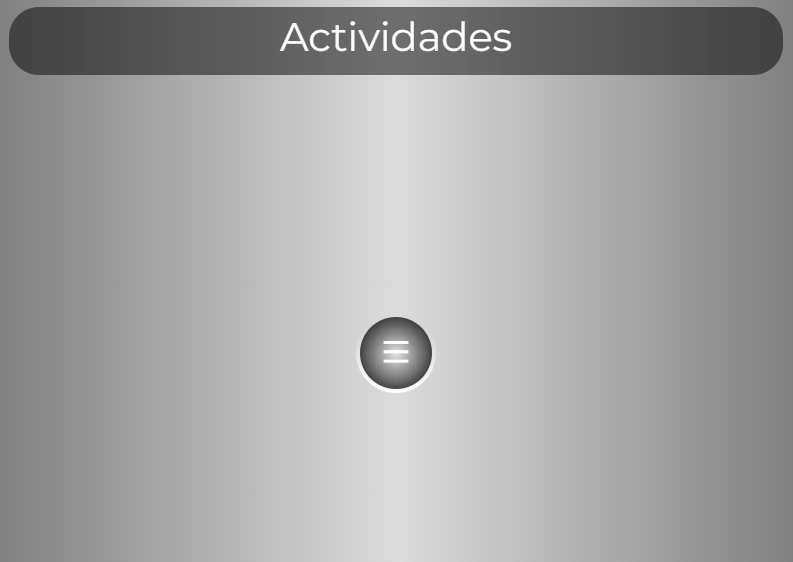

# **Tp_Final_Prog5**

  

## **Descripción**

Este proyecto es exclusivamente para las actividades de la materia de Programación 5. Se espera que se aprenda y aplique los siguientes temas:

- .NET 8
- Entity Framework
- MVC
- ADO
- Normalización de base de datos
- Arquitectura de aplicaciones
- ABM
- Implementación de Boostrap y jQuery

### Backend:
Para esto se utilizará el lenguaje C#, utilizando los Frameworks .NET 8 y ASP.NET.

### Frontend:
Se utilizará plantillas HTML Razor, para realizar páginas dinámicas junto a JavaScript y CSS.

### Para personalizar el readme

- https://www.youtube.com/watch?v=lGnvLt78sl8
- https://readme.so/es
- https://www.screentogif.com

### Guía de contenidos (En proceso...)

- https://docs.google.com/document/d/1Zy-JBVSpX3lHvdiPWkvyp9zqkiiTVnxDOkr7ZKuzgkQ/edit?usp=sharing
